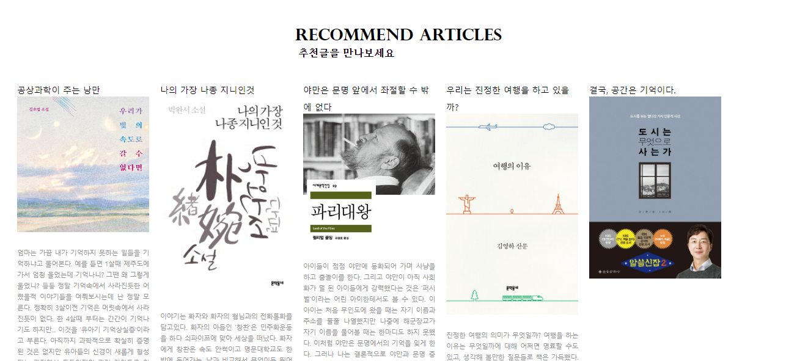

# KUSITMS 26기 React Study - BOOK;LOG 페이지 만들기

## 📝 리액트 스터디의 목표
1. 타입스크립트 능력 향상
2. 서버와 통신! (서버는 스프링부트로 구현)
3. 리액트 hooks에 대한 깊이 있는 이해
4. css 능력향상...!!

## 📚 BOOK;LOG

브런치 사이트에서 영감을 받아 책을 읽고 느낀점들을 기록하는 일종의 독서일지!
(내가 쓰고 싶어서 만들었다..!)

우당탕탕 백엔드가 궁금하다면? : https://github.com/JjungminLee/Kusitms_React_Back 

## 💥 개발일지

[1주차] : use-case,와이어프레임 작성, 회원가입 페이지 구현
[2주차] : 홈 화면 구현

로그인 정보가 있으 홈으로 리다이렉션 처리 (하는 중)

글 조회 API 만들기 (하는 중)